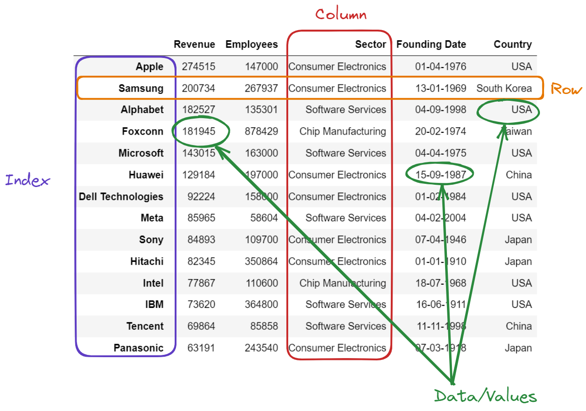

# Introduction To Pandas DataFrames

DataFrames are `Python`'s way of displaying data in tablular form.



## basics

#### a) `head`

The `head()` method displays the first five rows by default.

```python
df.head()
```

Expand our dataset further and specify the number of rows `.head(n)` within the brackets:

```python
df.head(10)
```

#### b) `tail`

The `tail()` method is similar to `head()` except it displays the **last** few rows of your DataFrame.

```python
df.tail()
```

```python
df.tail(10)
```

#### c) `info`

The `info()` method returns a list of all the columns in your `DataFrame`, along with their names, data types, number of values, and memory usage.

```python
df.info()
```

#### d) `shape`

The `shape` method returns a tuple with the number of rows and columns (rows, columns) in our `DataFrame`.

```python
df.shape
```

#### e) `describe`

The `describe()` method displays descriptive statistics for numerical columns in your `DataFrame`, including the `mean`, `median`, `standard deviation`, `minimum` and `maximum` values.

```python
df.describe()
```

#### f) `nunique`

The `nunique()` method counts the number of distinct elements.

```python
df.nunique()
```

#### g) `isnull`

The `isnull()` method detected missing values by creating a `DataFrame` object with a boolean value of `True` for `NULL` values and otherwise `False`.

```python
df.isnull()
```

.

```python
df.isnull().sum()
```

## Column Selection

1. Check the app_01.ipynb file to get the hang of it.
2. Also, `DataFrame`'s also allow the user to apply methods on columns, these functions include `sum()`, `mean()`, `min()`, `max()`, `median()` and more.
3. Select Multiple Columns and Apply Methods on more than one column at the same time.

```python
df[['column_name_1', 'column_name_2','column_name_3']].mean()
```

## Selection by Index: loc

It basically allows us to select the rows and columns by their labels.

```python
df.loc[row_label, column_label]
```

We can use `:` in place of `row_label` or `column_label` to call all the data.

```python
df.loc[:, column_label]

df.loc[row_label,:]
```

1. Check out the app_01.ipynb to get the hang of it.

### Slicing

**Slicing** is a powerful feature of pandas that enables us to access specific parts of our `DataFrame`.

> `start:stop:step`

If we don't specify the `step`, the default value is 1.

#### a) With `column`'s

```python
df.loc[`row_label`, `column_name_start`:`column_name_stop`]
```

#### b) With `rows`'s

```python
df.loc[`row_name_start`:`row_name_stop` , `column_label`]
```

#### c) With `step`

```python
df.loc[`row_label`, `column_name_start`:`column_name_stop`:n]

df.loc[`row_name_start`:`row_name_stop`:n , `column_label`]
```

#### d) With `step` and `:`

```python
df.loc[:`, `column_name_start`:`column_name_stop`:n]

df.loc[`row_name_start`:`row_name_stop`:n , :]
```

## Selection By Position-Iloc

Allows users to select rows and columns of a DataFrame **based on their integer positions** .

> This is especially useful when users need to access elements within a DataFrame that do not have labels or specific column names.

```python
df.iloc[row_position, column_position]
```

Use `:` in place of `row_position` or `column_position` to call all the data.

```python
df.iloc[:, column_position]

df.iloc[row_position,:]
```

Pass multiple columns in place of `column_position` or multiple rows in place of `row_position`.

```python
df.iloc[['row_position_1', 'row_position_2','row_position_3'], column_position]

df.iloc[row_position,['column_position_1', 'column_position_2','column_position_3']]
```

### Slicing

> `start:stop:step`

#### a) With `column`'s

```python
df.iloc[`row_position`, `column_position_start`:`column_position_stop`]
```

#### b) With `rows`'s

```python
df.iloc[`row_position_start`:`row_position_stop` , `column_position`]
```

#### c) With `step`

```python
df.iloc[`row_position`, `column_position_start`:`column_position_stop`:n]

df.iloc[`row_position_start`:`row_position_stop`:n , `column_position`]
```

#### d) With `step` and `:`

```python
df.iloc[:`, `column_position_start`:`column_position_stop`:n]

df.iloc[`row_position_start`:`row_position_stop`:n , :]
```

_Note: Check out the app_01.ipynb file to understand the examples._
